Prologue
========

**Data Quality Workshop summary (2017)**

**AXA entities fully recognized the need to effectively managed data quality** and initiate various projects or programs to tackle local challenges. Here are some illustrations:

+ AXA Belgium: Customer Information File implementation
+ AXA France: Master Data Management implementation based on KPIs/business pain points, Data Documentation (reference: morning presentation by AXA France CEO)
+ AXA Assistance: Data Management Office with ‘MyData Atlas’ tool for business issues solving
+ AXA Switzerland: SAP BP/CRM implementation
+ AXA Hong Kong: implementation of an integrated MDM tool and recently, a Data Management Office

There are also cross entity initiatives led by Data Management at DIL, under G11 and IT Big Bet 2.

**Entities are engaged in this topic with different level of maturity but share the same key challenges** for implementing data quality:

+ Engaging and funding, as there is usually no direct business output from it
+ Identifying data quality priorities, obtaining measures and being able to improve data quality by concrete actions – often, data producers (people collecting the data, e.g. a broker) and data consumers (e.g. Marketing campaign managers) have different priorities and improving the IT Legacy requires heavy investments (e.g. CIF/MDM implementations in Belgium and in France).

**Some key takeaways on Data Quality**:

+ Data Quality objectives must exist in each entity, bearing in mind there will always be a trade-off between cost of achieving a given level of quality and the additional benefits expected.
+ Best-practices, benchmarking and accelerators provided by the Group and shared across entities are useful, but in a pick-and-choose mode; e.g. Data Documentation is strongly needed, first for regulatory reasons (ex. GDPR). It will also help to deliver use cases more efficiently in the future.
+ There is a common definition for Data Quality Management, but no absolute measures across entities.
+ The Data Maturity Assessment provides a consistent measure for Data Management maturity levels across AXA.

**The outcome of these discussions is an obvious need for a handbook to support decision making process and align stakeholders to meet their data quality objectives.**

a. Introduction
---------------
This document formalizes a unified framework for managing and improving data quality as already implemented partially or totally within AXA entities. It is structured around a global approach to achieve data quality endeavors and provides practical guidelines for initiation and sustainability of data quality initiatives spanning both people, rules & processes, tools & solutions patterns, assets & experiences within AXA entities.

The global approach can be summarized as follow:

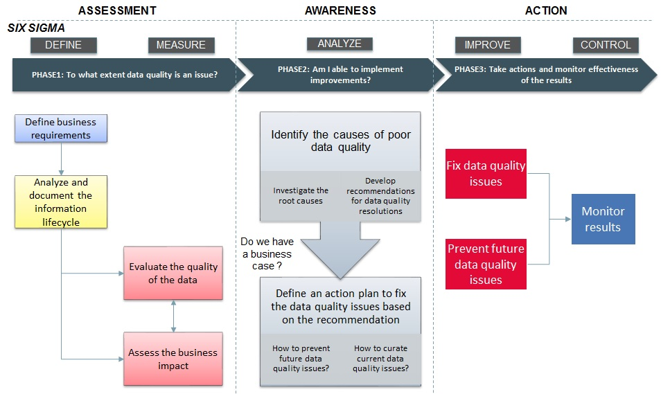

b. How to read this book
------------------------
The handbook is structured as follow:

+ Data quality scenarios to illustrate the global approach.
+ A global approach to achieve data quality endeavors as highlighted in the introduction. Each step of this approach is detailed with: objectives, inputs, suggested activities, outputs, data quality techniques to support the objectives, experiences or assets within AXA entities.
+ Data quality costs & benefits measurements examples.
+ Data quality tools & techniques.

c. Audiences
------------
The handbook is built for broad range of data practitioners such as:

+ Chief Data Officers
+ Data Quality Managers
+ Data Quality Analysts
+ Business Data Owners
+ Data Architects
+ Data Stewards

***

Data quality scenarios
======================

a. Scenario1
-------------------------
<h3>Do I have data quality issues destroying Business value?</h3>

 **Achievement at AXA**

AXA Partners has chosen to investigate its ticketing systems to identify defects that have never been solved. The output provides a list of data processing activities and data elements that might be affected by data quality.

 **Scenario assumptions**

+ There are many feedbacks related to operational issues and poor data quality identified or received.
+ We need to know to what extent operational issues are linked to data quality and the associated Business problems.

 **This data quality journey can be summarized as follow**

+ First, identify and document the business problems.
+ Then identify data processing activities related to these problems.
+ And finally prioritize data objects (ex. Customer) and data elements (ex. First Name, Last Name, Date of Birth…etc..) relevant to be assessed in order to define a business case.

**What are the relevant steps for this scenario in relation to the global approach?**

+ [`Define business requirements`](#Define)

b. Scenario2
-------------------------
<h3>How to identify critical data elements to prioritize my data quality endeavors?</h3>

 **Achievement at AXA**

AXA Global Business Line Health has identified the critical data elements required to run a health insurance and health services business. The critical data elements cover 4 business areas – enrollment, claims, provider, distribution – and are grouped into a document referred as the minimum health data set.

 **Scenario assumptions**

+ The importance of data quality is understood within the organization and there are business problems related to poor data quality identified.
+ We don’t know where to put the focus and effort to generate more impact across business use cases.

 **This data quality journey can be summarized as follow**

+ First, classify the data objects (see figure below) and data elements related to the business problems by data category and prioritize the focus. This classification can help to identify the critical data elements.
Reference data are key assets and have impact on the quality of master data and transactional data. Master Data are generally used and shared between applications so requires a high attention. Example: customer address is used for different Business processes like targeting, subscription, payment, servicing, renewal, etc.

+ Then document the information life cycle (data specifications, data mapping, technical environment, people and processes utilizing the data) to develop a realistic data assessment plan and further prioritize data objects (data elements) that can be assessed.

**What are the relevant steps for this scenario in relation to the global approach?**

+ [`Define business requirements`](#Define)
+ [`Analyze and document the information lifecycle`](#Analyze)

c. Scenario3
-------------------------
<h3>I'm launching a new business initiative, to what extent could data quality be an issue? </h3>

 **Achievement at AXA**

AXA Partners has implemented continuous data quality monitoring initially using Excel and moving forward into an industrialized approach with My Data Atlas. It allows them to standardize data quality assessment that can be leverage for any new project or business initiative. 

 **Scenario assumptions**

+ We have a new business initiative or we want to launch a new program
+ We want to rely on existing data available in the information system
+ We need to understand to what extent data quality could be an issue and our ability to implement improvements. 

Example: Build a 360-degree view of customers through CRM to improve customer segmentation & targeting.

 **This data quality journey can be summarized as follow**

+ Identify what to evaluate, the extent of lower quality and the impact on the project.
+ Then assess the ability to implement an improvement plan and define a business case.

**What are the relevant steps for this scenario in relation to the global approach?**

+ [`Define business requirements`](#Define)
+ [`Analyze and document the information lifecycle`](#Analyze)
+ [`Evaluate the quality of the data`](#Evaluate)
+ [`Assess the business impact`](#Assess_impact)
+ [`Identify the causes of poor data quality`](#Root_Causes)

d. Scenario4
-------------------------
<h3>I have identified data quality issues, how to tackle them?</h3>

 **Achievement at AXA**

AXA Gulf has implemented customer data cleansing and deduplication rules. The preliminary data profiling has provided three categories of records (looks valid, looks correctable, looks invalid). This classification provides insights on the data that can be corrected manually or automatically. In addition to the customer data cleansing automation, a data stewardship process has been implemented with data steward who can manually correct or approve the data. 

 **Scenario assumptions**

+ We have clearly identified the data objects and data elements with lower quality.
+ Our primary focus is to fix the data quality issues.

Example: Customers mails are not delivered and returned with the following notification: “not found at this address”.

 **This data quality journey can be summarized as follow**

+ Understand the current state of the data and identify root causes.
+ Then develop recommendations for resolutions, implement an action plan to fix the data quality issues and monitor the results.

**What are the relevant steps for this scenario in relation to the global approach?**

+ [`Define business requirements`](#Define)
+ [`Evaluate the quality of the data`](#Evaluate)
+ [`Identify the causes of poor data quality`](#Root_Causes)
+ [`Develop improvement plans`](#Improve)

d. Scenario5
-------------------------
<h3>How data quality management can help me to achieve data privacy objectives (ex. GDPR)?</h3>

 **Achievement at AXA**

AXA France has investigated the information lifecycle and identified personal data elements stored and manipulated in the different applications. They have also documented data processing activities and their right access to process personal data elements.   

                     

 **Scenario assumptions**

+ Data privacy requirements to be addressed in the entity context identified.                              
+ Identify accelerators or tools and techniques to meet regulations expectations.

 **This data quality journey can be summarized as follow**

+ Identified the requirements (data privacy rules) that can be covered by data quality management. Examples: Customer rights (data retention rules, right to be forgotten...etc.), data accuracy.                                 
+ Define a data quality baseline and the business case.                                 
+ Develop an improvement plan and take actions depending on the business case outcomes.

**What are the relevant steps for this scenario in relation to the global approach?**

+ [`Define business requirements`](#Define)
+ [`Analyze and document the information lifecycle`](#Analyze)
+ [`Evaluate the quality of the data`](#Evaluate)
+ [`Assess the business impact`](#Assess_impact)
+ [`Identify the causes of poor data quality`](#Root_Causes)
+ [`Develop improvement plans`](#Improve)
+ [`Fix data quality issues`](#Correct)
+ [`Prevent future data quality issues`](#Prevent)
+ [`Monitor results`](#Monitor)

***

Key steps 
========================================================
<h2>*to achieve successfully data quality endeavors*</h2>

> **Thomas C. Redman** <small>"The notion of quality is inherently customer- (or user-) centric. A collection of data
is of high quality, in the customer’s eyes, if and only if it meets his, her, or its needs. It is perhaps the simplest way of thinking about quality and it is certainly
the most powerful, but it has profound implications. It means that data quality is
inherently subjective"</small>

**Experiences or assets in AXA context **

AXA Switzerland formalize their data quality process (see below) and defines the following principles to ensure that data quality is effectively managed:

1.	The business is responsible for the content-related data quality and the IT for the technical aspects.
2.	The business identifies the business-critical processes and defines the data quality requirements.
3.	The 1st / 2nd / 3rd line of defense ensures that the responsibilities assigned to them are fulfilled.
4.	Each dataset has a data owner and at least one data steward.
5.	Data ownership extends across application and organizational boundaries, provided that the nature of the data remains essentially unchanged. If the nature of the data is changed or placed in a new context, ownership must be redefined.
6.	Data quality controls consider the criteria of completeness, correctness and appropriateness of the data at operational, tactical and corporate level.
7.	The defined data quality controls are continuously checked, processed and reported.
8.	The checks are carried out as soon as possible in the data flow.
9.	DQ issues are fixed at the source.
10.	The business-critical data and their KPI's must be comprehensible to the user and must be described from a business point of view. The descriptions are accessible to the user.

The key steps to achieve successfully data quality endeavors can be summarized as follow:

+ **Assessment**: understand the current state of my environment and data and compare them with my business expectations.
+ **Awareness**: establish a data quality business case based on the root causes understanding and my ability to implement improvements.
+ **Action**: curate, prevent and monitor.   

PHASE1
-----------------------------------------
<h3>DO I HAVE A DATA QUALITY ISSUE?</h3>

### Define {#Define}

**Experiences or assets in AXA context **

+ AXA Spain has interviewed business owners to collect business requirements and prioritize data elements to be evaluated.
+ AXA Global Business Line Health has identified the critical data elements required to run a health insurance and health services business. The critical data elements cover 4 business areas – enrollment, claims, provider, distribution – and are grouped into a document referred as the minimum health data set. 
+ AXA Partners has chosen to investigate its ticketing systems to identify defects that have never been solved. The output provides a list of data processing activities and data elements that might be affected by data quality.
+ AXA Belgium has documented and classified according to AXA over 15 000 data elements into personal data (direct, indirect or not) as well as into crown jewels.
+ AXA Gulf as part of their data governance initiative has investigated data quality issues related to customer data (duplication of customers within applications, invalid contact information, wrong birth dates which do not comply with birth date pattern) and data processing activities impacted (ex. creation of customers for each policy).
+ AXA Switzerland conducts a data quality assessment with the affected business owners. As a result, they get the critical processes and data and define them as KPIs.

<h4>**Define business requirements**</h4>

 **Objective**

+ Describe the high-level context: Data, Processes and People/Organizations
+ Prioritize the data objects and data elements relevant for the business context
+ Clarify the focus and ensure that it has value to the business

 **Inputs**

+ The business opportunity where data or information is a component
+ Business goals or strategies
+ The operational issues reported by the business team

 **Activities**

+ Document the data processing activities related to the inputs provided (ex. business goals, strategies or opportunities, operational issues…etc.) and the data objects involved into these processes. Here are some examples of data processing activities: Fraud detection, Pricing optimization, customer invoicing... etc.
+ For each data processing activity, organize workshop with stakeholders to prioritize the data objects and data elements relevant for the process: Mandatory, Nice to have, Irrelevant.

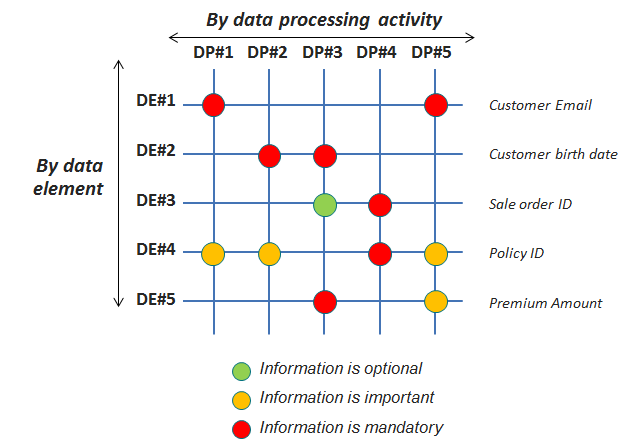

+ Document the business problems related to the data processing activities.
+ Identify common personal data and sensitive personal data to make sure that proper information protection guidelines are followed according to AXA standards.
+ A good way to prioritize data elements and data objects relevant for the business is also to refer to the business critical KPI's.

 **Outputs**

+ A description of the data processing activities (data, processes and people/organizations)
+ A clear documented agreement of the data objects/data elements relevant for the use case and their priority in relation to the data processing activities.
+ Documented business problems
+ Communicate the results

 **Data Quality Techniques**

Data quality techniques to support activities in this step

+ Metadata documentation: business metadata documentation such as business name, business definition, security classification & policy, privacy classification & policy…etc.
+ Data profiling: analytical technique to measure the existence, validity, structure, content and other basic characteristics of the data.
+ Data discovery: search relationship between data objects, data elements. Uncover business rules, data assets or identified data domains.

 **Responsible**

+ Business Data Owner

### Analyze {#Analyze}

**Experiences or assets in AXA context **

+ AXA Spain has interviewed IT stakeholders to define data capture plan and possible improvements directly in the system.
+ AXA Global Business Line Health, following the preliminary step of identifying the minimum critical data elements, has investigated with the support of the entities (AXA Germany, AXA France, AXA Hong Kong, AXA Life Japan, AXA Gulf, AXA Mexico, AXA UK) the gap between the minimum list and the data effectively collected by the entities. The outcome of this analysis has been a mapping of data availability (digitally and on paper) which can be used to define quick actions to broaden the spectrum of data collected.

<h4>**Analyze and document the information lifecycle**</h4>
This step will serve as an input later in the data quality journey for capturing the data to evaluate or investigate data quality issues root causes. It will also provide the necessary inputs to extract or access: the right data, from the right system, for the right process.

 **Objective**

+ Document the life cycle of the information prioritized in the previous step
+ Develop an initial plan for capturing and assessing the data
+ Provide a context for understanding the results of the data assessments

 **Inputs**

+ Deliverables from previous step “Define business requirements”
+ Additional existing documentations related to the information environment (data specifications, technology architecture, data models, business process documentations, people and organizations chart)

 **Activities**

+ Identify the systems/applications/databases where the data is used and stored.
+ Gather for each data element, the data specifications with the support of knowledgeable people (business analyst, developer, database administrator, data modelers…and so on): metadata, data models, business rules, reference data and any other relevant information. Example:

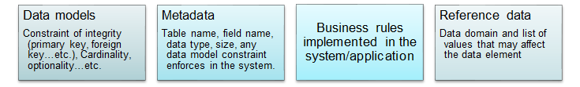

+ Use data mapping when assessing a data element in more than one system/application/database.
+ Understand and document the technical environment. If available, the existing documentations can be used. Identify any security constraints that may prevent the team from accessing the data.
+ Analyze and document the processes, people/organizations that might affect the data objects/data elements through the information (Classification ex. Create, Modify, Use) –  See below an example:

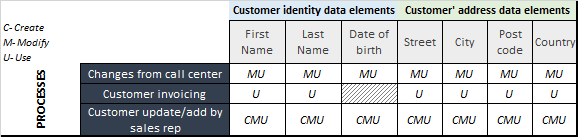

+ Document the timing (hourly, daily, weekly, monthly…etc.) of the interactions between the data objects/data elements and the data processing activities/people/organizations.
+ For each task above (data specifications, data mapping, technical environment, people and processes utilizing the data) assess any impact to data quality. See in section [Costs & Benefits](#Costs_Benefits) a list of common data quality problems.
+ Design data capture and assessment plan:
  + Further prioritize based on the previous tasks achieved
  + Define the scope of the data to be assessed and develop a plan for data capture: 
    	+ How to access the data (ex. Front end application, data extraction…etc.)
    	+ Output format (flat files, files in HDFS, tables in Hive…etc.)
    	+ Sampling method
    	+ Timing
    	+ Who will be involved?

 **Outputs**

+ Data quality problems identified during the information lifecycle analysis
+ Data capture and data assessment plan (including definition of the scope of data objects/data elements to be assessed and the selection criteria).
+ Documentation resulting from analyzing the information life cycle (data specifications, data mapping, technical environment, people and processes using the data).
+ Communicate the results

 **Data Quality Techniques**

Data quality techniques to support activities in this step

+ Metadata documentation: 
  + Business metadata documentation such as business name, business definition, security classification & policy, privacy classification & policy…etc.
  + Technical metadata documentation such as source system, physical location, owner, data structure, data relation, retention policy, data privileges and access, data lineage…etc.
+ Data profiling: analytical technique to measure the existence, validity, structure, content and other basic characteristics of the data.
+ Data discovery: search relationship between data objects, data elements. Uncover business rules, data assets or identified data domains.

 **Responsible**

+ Data Architect

### Evaluate {#Evaluate}

**Experiences or assets in AXA context **

+ AXA Spain has developed and executed SQL directly on the Big Data platform.
+ AXA Global Business Line Health has developed their own solution which takes as inputs a description of the data quality rules in a predefined format (Excel) and the raw data to be evaluated (Excel). The tool runs the data through 5 quality dimensions: completeness, accuracy, validity, integrity, uniqueness – providing quality scores at various levels: score for the entire data set; score per variable per dimension; score per dimension across variables.
+ AXA Partners has initially implemented data quality controls using Excel and move forward into industrialized data quality monitoring with My Data Atlas.
+ AXA Gulf and DIL have developed an application in python (based on Pandas library and matplotlib) that takes a csv file as input and report statistics on the dataset (missing values, cardinality, correlation…etc.)

<h4>**Evaluate the quality of the data**</h4>
This step will provide concrete evidence of the data quality problems identified during the analysis of the information life cycle. As a prerequisite to this step, I need to answer the following questions:

+ Which tool to assess data quality? See Data quality improvements techniques

 **Objective**

+ Define applicable data quality dimensions to my data objects/data elements
+ Evaluate the quality of my data objects/data elements

 **Inputs**

+ Deliverables from step “Define business requirements” and step “Analyze and document the information lifecycle”
+ Inputs from step “Analyze and document the information lifecycle” should be included at minimum
	+ The data objects/data elements prioritize for the assessment
	+ The data objects/data elements specifications
	+ The list of data quality problems identified for each data element
	+ The plan for data capture (where to capture the data, when, how, with who?)

 **Activities**

+ Choose which dimensions* to assess for each data object/data element. Make the decision by answering the following question:
 + Does the result of testing the dimension give actionable information?
 + Can I achieve the test? (costs, security reason, availability of systems…etc.)

<small>*The DMBOK suggests detailed definitions of the data quality dimensions about which there is a general agreement. Examples: Accuracy, Completeness, Timeliness, Privacy, Integrity, Consistency…</small>

+ The table below provides some examples of data quality problems and their relationship with data quality dimensions

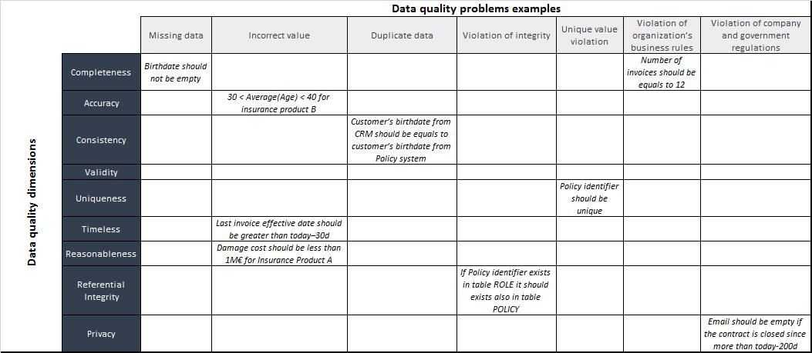

+ Data profiling is a good starting point in this scenario. It is very useful to validate data specifications, data mapping and selection criterion defined in step2 “Analyze and document the information lifecycle”. It could also help uncover unknown issues. Examples:
 + It has been decided that consistency test will be performed between the CRM and policy system for the customer birth date. But data profiling shows that only 50% of the customer’s records have the birth date filled in the CRM. Therefore, evaluating the consistency dimension for this data element between these two systems will not be effective.
 + Customer place of birth has been identified as critical data element for the use case but only 10% of the customer’s records have this information filled in the system of reference.
+ The previous task is helpful to further refined the scope of the data quality assessment.
+ For each data object/data element, define the KPIs for the data quality dimensions identified. The table below provides some examples of KPIs per dimension:

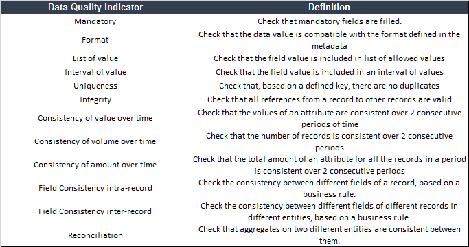

+ The KPIs will be translated in data quality rules that can be evaluated with data quality monitoring tools.
+ The data quality controls can be performed for a data point, across multiple data points or across datasets.

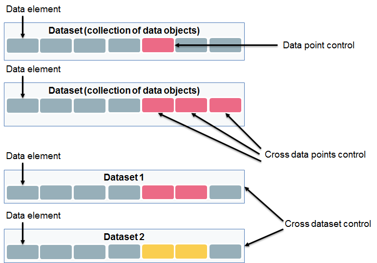

 **Outputs**

+ Document data quality assessments results
+ Communication plan

 **Data Quality Techniques**

Data quality techniques to support activities in this step

+ Data profiling: analytical technique to measure the existence, validity, structure, content and other basic characteristics of the data.
+ Data quality monitoring: repository rules engine to measure and report data quality.

 **Responsible**

+ Data Steward

### Assess impact  {#Assess_impact}

**Experiences or assets in AXA context **

+ AXA Direct Seguros has done an extensive work to capture operational losses. They have first identified operational risks defined as an incident arises from a business process that differs from its expected outcome due to inadequate or failed processes, people and systems, or due to external factors or circumstances. Then the losses have been quantified and gave some inputs for poor data quality costs evaluation. These costs are classified in three categories (system, people, customer) and detailed in the figure below: Figure 20 - Data quality costs AXA Direct Seguros.

<h4>**Assess the business impact**</h4>

 **Objective**

+ Establish the impact of data quality issues on the use case:
 + Qualitative
 + Quantitative
+ Provide inputs to establish a business case for data quality improvements

 **Inputs**

Data quality problems identified from the step: 

+ Analyze and document the information lifecycle

 **Activities**

Business impact may not mean the same thing for the different stakeholders depending on the use case. It could be: increased revenue, money saved, operational efficiency, decreased risk…etc.

+ Collect concrete examples of the business problems identified and match them with data quality problems.
+ For each business problem define the business impact weight. Example: Classify business impact severity and apply weight using Fibonacci series

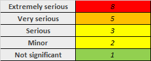

+ Evaluate the business benefit by measuring the business impact. One way to evaluate business benefit for each business problem is to combine the percentage of defect for each data quality problem and the business impact: 
	+ Benefit=(1-Data Quality KPI result)x Business impact weight.
	+ See below an example:

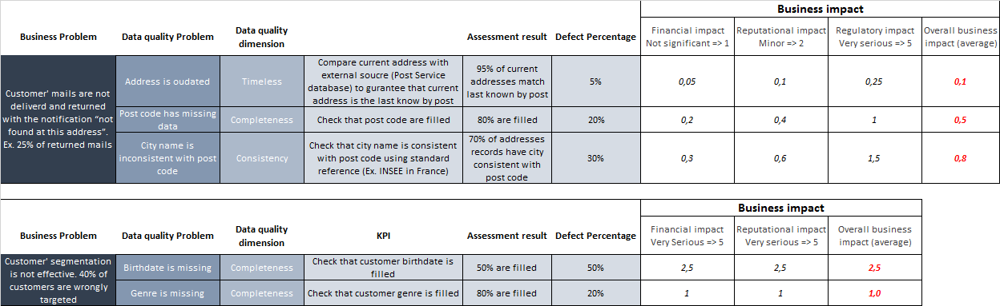

+ Evaluate the costs of poor data quality and the costs of improving data quality. Decide which cost to evaluate. Please refer to section [Costs & benefits](#Costs_Benefits)
+ Build the business impacts versus cost matrix and prioritize defects curation or prevention.

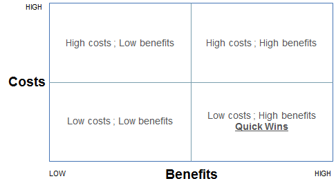

 **Outputs**

+ Business impact assessment (qualitative and quantitative)
+ Benefit versus Cost matrix
+ Initial recommendation plan to further prioritize defects curation and prevention
+ Communication plan

 **Data Quality Techniques**

...

 **Responsible**

+ Business Data Owner

PHASE2
-----------------------------------------
<h3>AM I ABLE TO IMPLEMENT IMPROVEMENTS?</h3>

### Identify root causes  {#Root_Causes}

**Experiences or assets in AXA context **

+ AXA Spain has interviewed IT stakeholders to investigate root causes of data quality. In addition to the information lifecycle analysis, they have further investigated the controls implemented in the operational systems and their impact on the quality of the data.

<h4>**Identify the causes of poor data quality**</h4>

 **Objective**

+ Identify the causes of poor data quality
+ Develop recommendation for addressing the root causes

 **Inputs**

Results from steps: 
+ Analyze and document the information lifecycle
+ Evaluate the quality of the data 
+ Assess the business impact

 **Activities**

+ Use output from step2 (data specifications, data mapping, technical environment, people and processes utilizing the data) to track down the causes of the defects
+ The root cause can be either technical or related to the business process
+ Further estimate repair and prevention costs.
+ Update business impact assessment (benefit versus cost matrix, recommendation plan).

 **Outputs**

+ Specific recommendations for addressing data quality issues
+ Updated business impact assessment
+ Communication plan

 **Data Quality Techniques**

Data quality techniques to support activities in this step

+ Metadata documentation: 
  + Business metadata documentation such as business name, business definition, security classification & policy, privacy classification & policy…etc.
  + Technical metadata documentation such as source system, physical location, owner, data structure, data relation, retention policy, data privileges and access, data lineage…etc.
+ Data profiling: analytical technique to measure the existence, validity, structure, content and other basic characteristics of the data.
+ Data discovery: search relationship between data objects, data elements. Uncover business rules, data assets or identified data domains.

 **Responsible**

+ Data steward

**At this stage, all the relevant information to establish a data quality business case and decide to move further in the data quality journey are available.**

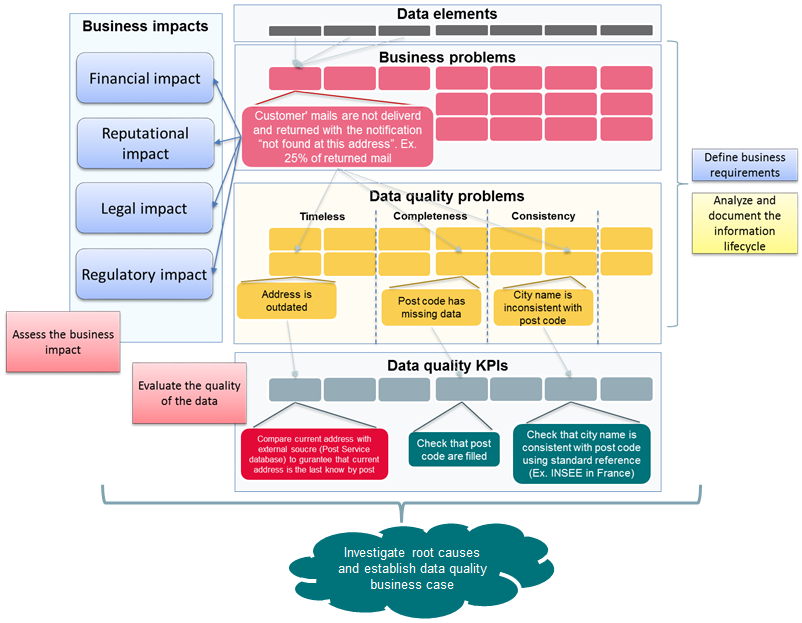

### Improve {#Improve}

**Experiences or assets in AXA context **

+ AXA Spain has decided to put the focus on data quality resolution after preliminary data quality assessment and business impact assessment. Cleaning historical data has not been prioritized due to the lack of effective business rules and the necessity to contact the customers to collect missing or incorrect information.

<h4>**Develop improvement plans**</h4>

 **Objective**

Develop an action plan based on the following steps outputs:

+ Evaluate the quality of the data
+ Assess the business impact
+ Identify the causes of poor data quality

 **Inputs**

+ List of high priority defects
+ Results of data quality evaluation
+ Business impact assessment
+ Benefit versus costs matrix
+ Recommendations from previous steps

 **Activities**

+ Prioritize recommendations:
	+ How to prevent future data quality issues?
	+ How to curate current data quality issues?

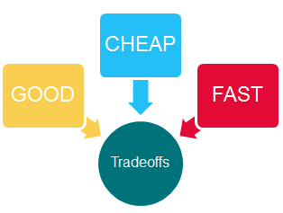

+ Identify accountability and develop plans

 **Outputs**

+ Recommendations and action plan to address the data quality issues
+ RACI associated with the action plan
+ Communication plan

 **Data Quality Techniques**

Data quality techniques to support activities in this step

+ Data profiling: analytical technique to measure the existence, validity, structure, content and other basic characteristics of the data.
+ Data discovery: search relationship between data objects, data elements. Uncover business rules, data assets or identified data domains.

 **Responsible**

+ Data steward

PHASE3
-----------------------------------------
<h3>TAKE ACTIONS AND CONTINUOUS ASSESSMENT</h3>

### Correct {#Correct}

**Experiences or assets in AXA context **

+ AXA Gulf has implemented customer data cleansing and deduplication rules. The preliminary data profiling has provided three categories of records (looks valid, looks correctable, looks invalid). This classification provides insights on the data that can be corrected manually or automatically. In addition to the customer data cleansing automation, a data stewardship process has been implemented with data steward who can manually correct or approve the data.

<h4>**Fix data quality issues**</h4>

 **Objective**

+ Implement correctives actions to fix the issues identified in Phase1 that have impact on the use case.

 **Inputs**

Improvement plan from step: 

+ Develop improvement plans

 **Activities**

+ Implement a data cleansing solution. See section `Data quality improvements techniques` for further details.

 **Outputs**

+ Data quality monitoring results showing that the corrections have been implemented according to the specifications and expectations.

 **Data Quality Techniques**

Data quality techniques to support activities in this step

+ Data cleansing: Standardization, Parsing, Validation or verification, Record Linking thru a user-defined algorithm, Duplicate detection, Entity resolution (Exact matching/ probabilistic (Fuzzy) matching), Merge, Screen emulator: useful when too many records need to be updated manually.
+ Data sourcing: complete data sets with external data sources.
+ Noise reduction: manage data uncertainty (with volume, variety and noisy data sources) by using algorithm and statistical method to curate the data.
+ Data quality monitoring: repository rules engine to measure and report data quality.

 **Responsible**

+ Business data owner

### Prevent {#Prevent}

**Experiences or assets in AXA context **

+ AXA Partners is considering providing data quality controls as a service to enforce data quality rules across all applications within the information systems.

<h4>**Prevent future data quality issues**</h4>

 **Objective**

+ Implement actions to address the root causes identified in Phase2.

 **Inputs**

Improvement plan from step: 

+ Develop improvement plans

 **Activities**

+ Implement tools and techniques to fix the root causes. See section E for further details: Data quality improvements techniques. Examples:
 + User interface or applications controls
 + Master data management
 + Metadata documentation
 + …etc.
+ Implement data quality monitoring.
+ Define data quality SLAs with data providers.

 **Outputs**

+ Documented changes to the current business processes if any
+ Documented RACI and SLAs resulting from those changes
+ Training plan for the personnel impacted by the implementation of preventive actions.
+ Communication plan.

 **Data Quality Techniques**

Data quality techniques to support activities in this step

+ Metadata documentation: 
 + Business metadata documentation such as business name, business definition, security classification & policy, privacy classification & policy…etc.
 + Technical metadata documentation such as source system, physical location, owner, data structure, data relation, retention policy, data privileges and access, data lineage…etc.
+ Master Data Management: Build a trusted view of master data such as customer, product, supplier, legal entities…etc.
+ Data modelling
 + Referential integrity: primary key, foreign key
 + Constraints and controls: unique constraint, nullable, list of values …etc.
+ User interface or applications controls to enforce data quality rules at the beginning of the information lifecycle.
+ Data quality monitoring: repository rules engine to measure and report data quality.

 **Responsible**

+ Business data owner

### Monitor {#Monitor}

**Experiences or assets in AXA context **

+ AXA Spain uses Tibco Spotfire for data quality monitoring. Back-end SQL queries are executed directly on the data lake.
+ AXA Partners has developed their own solution (My Data Atlas v1).
+ AXA Gulf has implemented data quality monitoring dashboard with Power BI for data quality evaluation. They foresee Tibco Spotfire as a long-term solution.

<h4>**Monitor results**</h4>

 **Objective**

+ Measure the effectiveness of my actions plans to fix or prevent data quality.

 **Inputs**

Results from steps:

+ Develop improvement plans
+ Fix data quality issues
+ Prevent future data quality issues

 **Activities**

+ Implement ongoing monitoring of the KPI’s defined in step3: Evaluate the quality of the data
+ Monitor the quality of data objects/data elements that have been identified as relevant for the use case.

 **Outputs**

+ Monitoring dashboard
+ Communication plan.

 **Data Quality Techniques**

Data quality techniques to support activities in this step

+ Data quality monitoring: repository rules engine to measure and report data quality.

 **Responsible**

+ Business data owner

ROLES & RESPONSABILITIES
-----------------------------------------
<h3>HIGH LEVEL ROLES & RESPONSABILITIES (PROPOSAL)</h3>

PHASE|STEP|BUSINESS DATA OWNER|DATA STEWARD|DATA ARCHITECT
:---:|:--:|:-----------------:|:----------:|:------------:
ASSESSMENT|Define business requirements|X|-|-
ASSESSMENT|Analyze and document the information lifecycle|-|-|X
ASSESSMENT|Evaluate the quality of the data|-|X|-
ASSESSMENT|Assess the business impact|X|-|-
AWARENESS|Identify the root causes of poor data quality|-|X|-
AWARENESS|Develop improvement plans|-|X|-
ACT|Fix data quality issues|X|-|-
ACT|Prevent future data quality issues|X|-|-
ACT|Monitor results|X|-|-

Costs & Benefits {#Costs_Benefits}
========================================================
<h2>*Data quality costs & benefits measurements examples*</h2>

Data quality costs are usually evaluated in relation to the data quality defects identified in the information system (see below). The business impact of the defects need to be assessed and will provide the inputs to build a cost and benefit model. However, the data quality costs should not be assessed only by looking at the cost of poor data quality. The cost of improving data quality should also be considered. 

**Common data quality defects**

> Ge M. and Helfert M. (2013) <small>provide below a list of common data quality problems classified into two categories:</small>

<table>
<tr>
<td></td>
<td>**INFORMATION PERSPECTIVE**</td>
<td>**USER PERSPECTIVE**</td>
</tr>
<tr>
<td>**CONTEXT-INDEPENDENT**</td>
<td>
+ Spelling error
+ Missing data
+ Duplicate data
+ Incorrect value
+ Inconsistent data format
+ Outdated data
+ Incomplete data format
+ Syntax violation
+ Unique value violation
+ Violation of integrity constraints
+ Text formatting
</td>
<td>
+ The information is inaccessible
+ The information is insecure
+ The information is hardly retrievable
+ The information is difficult to aggregate
+ Errors in the information transformation
</td>
</tr>
<tr>
<td>**CONTEXT-DEPENDENT**</td>
<td>
+ Violation of domain constraint
+ Violation of organization’s business rules
+ Violation of company and government regulations
+ Violation of constraints provided by the database administrator
</td>
<td>
+ The information is not based on fact
+ The information is of doubtful credibility
+ The information is irrelevant to the work
+ The information consists of inconsistent meanings
+ The information is hard to manipulate
+ The information is hard to understand
</td>
</tr>
</table>

The data quality costs can be classified as follow:

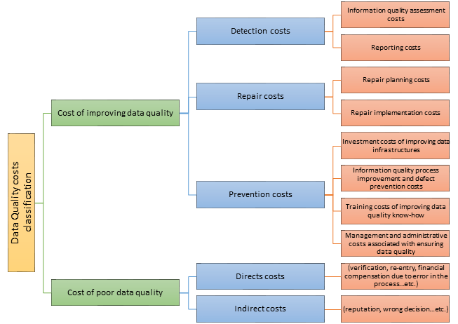

**Costs resulting from poor data quality**

> Ge M. and Helfert M. (2013) <small>suggest the following list of possible costs resulting from lower quality of the data:</small>

	1. Data maintenance costs
	2. Personnel costs
	3. Data search costs
	4. Data quality assessment costs
	5. Semantic confusion costs
	6. Data re-input costs
	7. Wrong data interpretation costs
	8. Time costs of viewing irrelevant information
	9. Loss of revenue
	10. Cost of losing current customer
	11. Cost of losing potential new customer
	12. Cost of realigning business rules
	13. Cost of complicated data integrity
	14. “Loss of orders” cost
	15. Higher retrieval costs
	16. Higher data administration costs
	17. General waste of money
	18. Cost of system migration and reengineering
	19. Costs in terms of lost opportunity
	20. Costs due to tarnished image
	21. Costs related to invasion of privacy and civil liberties
	22. Costs in terms of personal injury and death of people
	23. Costs because of lawsuits
	24. Process failure costs
	25. Information scrap and rework costs
	26. Lost and missed opportunity costs
	27. Costs due to increased time of delivery
	28. Costs of acceptance testing

**Experiences or assets in AXA context **

Below is an example of poor data quality costs estimation provided by AXA Direct Seguros:
`todo-put image here`

Data quality improvements techniques
========================================================

This section shed the light on common techniques required to meet data quality objectives. The techniques describe in the document can be used to support decision making process when selecting a data quality tool.

Data quality techniques
-----------------------------------------

**Metadata management**

+ Metadata Repository: document, manage, perform analysis on metadata, infer metadata, distribute and publish metadata 
+ Business Glossary: document, govern and communicate enterprise business terms with their definitions and relationships
+ Data lineage / impact analysis: 
 + track the way of data along the processes they undergo
 + identify the impact of changes along the transformation chain
+ Rule Management: 
 + enforce business rules associated to elements and associated metadata
 + automated workflow to support information stewardship and governance
+ Semantic framework: support taxonomy, classification, tagging 
+ Metadata capture: connectors and bridges for various sources (data bases, ETL-tools, BI-tools, modeling tools, other tool repositories, XML-formats, spreadsheets, etc.)
+ Customization: ability to adapt and enhance the repository model according to the enterprise needs

**Curation**

+ Noise reduction: manage data uncertainty (with volume, variety and noisy data sources) by using algorithm and statistical method to curate the data.
+ Data standardization
+ Data deduplication
+ Identity resolution (Exact matching/ probabilistic (Fuzzy) matching)
+ Data sourcing: complete data sets with external data sources.

**Prevention**

+ User interface or application control
+ Data sourcing: complete data sets with external data sources.
+ Data validation
+ Data standardization

**Assessment and Monitoring**

+ Data profiling: analytical technique to measure the existence, validity, structure, content and other basic characteristics of the data. Examples:
 + Completeness: percentage of records has missing or null values
 + Uniqueness: unique values an attribute has
 + Distribution: distribution of values of an attribute (character or numeric)
 + Statistics: mean, standard deviation, minimum, maximum for numerical attributes
 + Outliers: outliers in the numerical data
 + Pattern matching: patterns that are matched by data values of an attribute (date, timestamp, email, …)
 + Correlation and functional dependency: correlation between attributes
+ Data quality monitoring: repository rules engine to measure and report data quality.

**Experiences or assets in AXA context **

Data scientists at DIL use python libraries for data profiling. Example of data profiling with Spark Data Frame (Python/ Java / Scala):

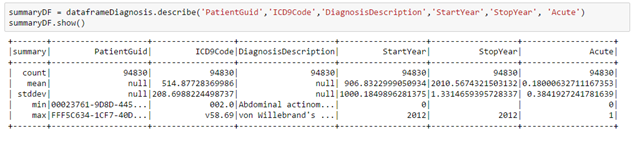

Data quality platform architecture example
-----------------------------------------
The data quality assurance platform is based on 3 main components:

+ A metadata repository to manage metadata definitions and business rules
+ A data quality engine to realize data quality assessments (execute the rules) and to store the results
+ A reporting and analysis tool to provide dashboards and ad-hoc analysis capability 

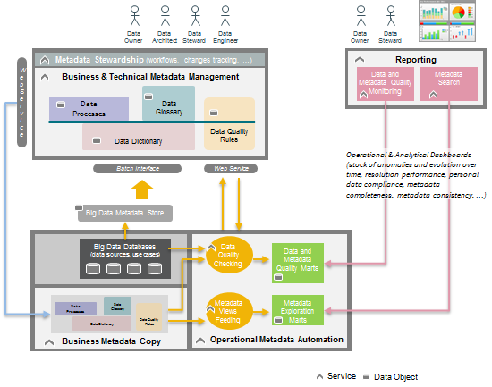

References
========

**Revision History of working version**

  ***Version***   ***Date***   ***Author***         ***Description***
  --------------- ------------ -------------------- ----------------------------------------------------------
  **V0.0**        2017-09-01   Guillaume HERVOUIN   Initialization of the document
  **V0.1**        2017-10-01   Pastel GBETOHO       First version for internal review of the document
  **V0.2**        2017-10-31   Pastel GBETOHO       Integration of AXA Spain feedbacks
  **V0.3**        2017-11-07   Pastel GBETOHO       Integration of AXA Global Business Line Health feedbacks
  **V0.4**        2017-11-21   Pastel GBETOHO       Integration of AXA Switzerland feedbacks
                                                    

**AXA Internal References**

  ***Title***                                            ***Description***
  ------------------------------------------------------ --------------------------------------------------------------------------------------------------------------------------------------
  ***AXA-Data Classification Policy-v1 3***              Data Group Data Classification Policy: Data Security Classification, Identification of Crown Jewels, Group Severity Assessment Table
  **AXA SOLVENCY II - Group Data quality Policy V2.2**   Solvency II requirements, Data Quality Monitoring Activities, Impact Analysis
  **AXA Data Governance guidelines**                     CDOs role and interactions with stakeholders
                                                         

**External References**

  ***Title***                    ***Description***
  ------------------------------ --------------------------------------------------------------------------------------------------------------------------------------------------------------------
  **DAMA-DMBOK\_2 (2017)**       Data Management Body of Knowledge: Metadata Management, Data Quality Management, Data Security
  **Lean Six Sigma**             Data-Driven Approach for Data Quality improvement
  **Redman T.C. (2012)**         Data Quality Management Past, Present, and Future: Towards a Management System for Data. In: Sadiq S. (eds) Handbook of Data Quality. Springer, Berlin, Heidelberg
  **McGilvray D. (2013)**        Data Quality Projects and Programs. In: Sadiq S. (eds) Handbook of Data Quality. Springer, Berlin, Heidelberg
  **Ge M., Helfert M. (2013)**   Cost and Value Management for Data Quality. In: Sadiq S. (eds) Handbook of Data Quality. Springer, Berlin, Heidelberg
                                 

**AXA Experiences contacts**

+----------------------+----------------------+----------------------+
| ***Entity***         | ***Contact***        | ***Experience        |
|                      |                      | summary***           |
+======================+======================+======================+
| **AXA Gulf**         | Joel FARVAULT        | Customer master data |
|                      |                      | management.          |
+----------------------+----------------------+----------------------+
| **AXA Direct         | Jose RIESCO          | Data quality costs   |
| Seguros**            |                      | evaluation.          |
|                      | Esther VILLAR        |                      |
+----------------------+----------------------+----------------------+
| **AXA Spain**        | Ubaldo GONZALEZ      | Data quality         |
|                      |                      | assessment.          |
+----------------------+----------------------+----------------------+
| **AXA Global         | Anca MIHALACHE       | Minimum health data  |
| Business Line        |                      | set definition and   |
| Health**             |                      | data quality         |
|                      |                      | assessment.          |
+----------------------+----------------------+----------------------+
| **AXA Belgium**      | Valérie LAURENT      | Data elements        |
|                      |                      | classification into  |
|                      | Fabian GREGOIRE      | personal data        |
|                      |                      | according to AXA     |
|                      |                      | standards.           |
+----------------------+----------------------+----------------------+
| **AXA Switzerland**  | Wirthlin CHRISTIAN   | Data quality process |
|                      |                      | and governance       |
|                      | Stefania BISSIG      | definition. Data     |
|                      |                      | quality assessment.  |
+----------------------+----------------------+----------------------+
| **AXA Partners**     | Christophe           | Data quality         |
|                      | DRUETTO-LAFON        | assessment           |
|                      |                      | industrialization.   |
|                      | Fabien VANNIER       |                      |
+----------------------+----------------------+----------------------+
| **AXA France**       | Jean-Sébastien       | Personal data map    |
|                      | ARMAND, Fanny        | across the           |
|                      | VUILLEMIN            | information system.  |
+----------------------+----------------------+----------------------+
|                      |                      |                      |
+----------------------+----------------------+----------------------+

**Approval list**

  ***Approved by***   ***Entity***
  ------------------- -------------------------
  **Nicolas SHIRE**   AXA DIL Data Management
                      
